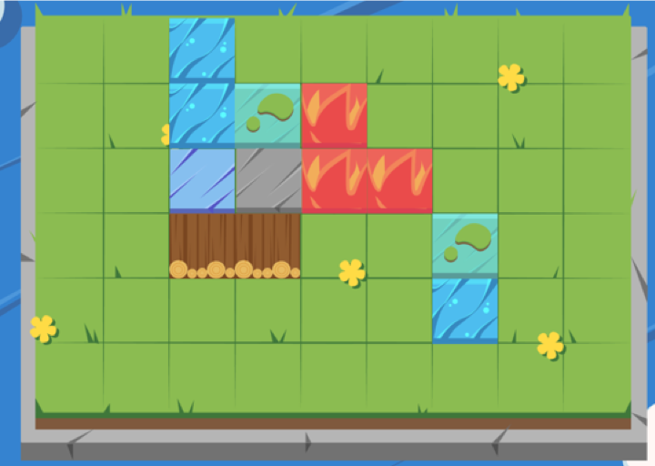
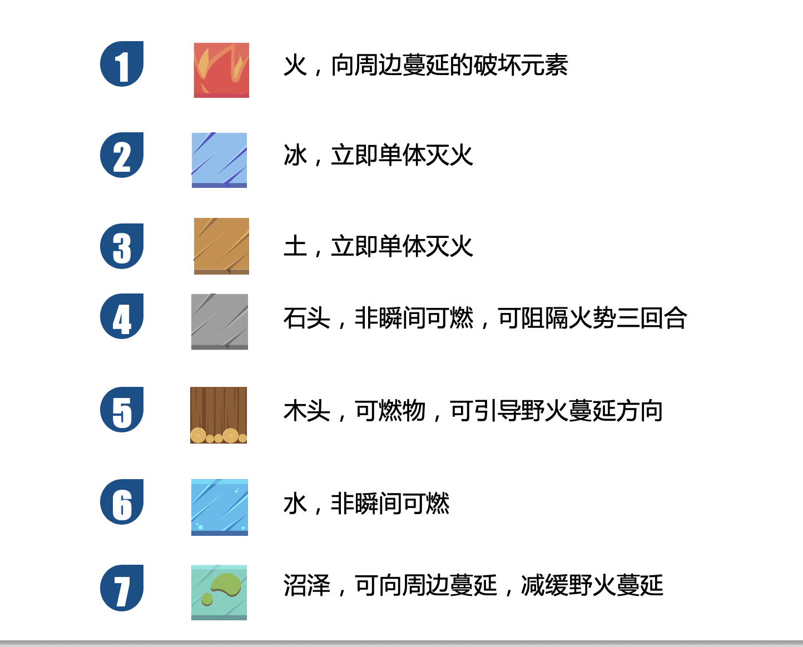
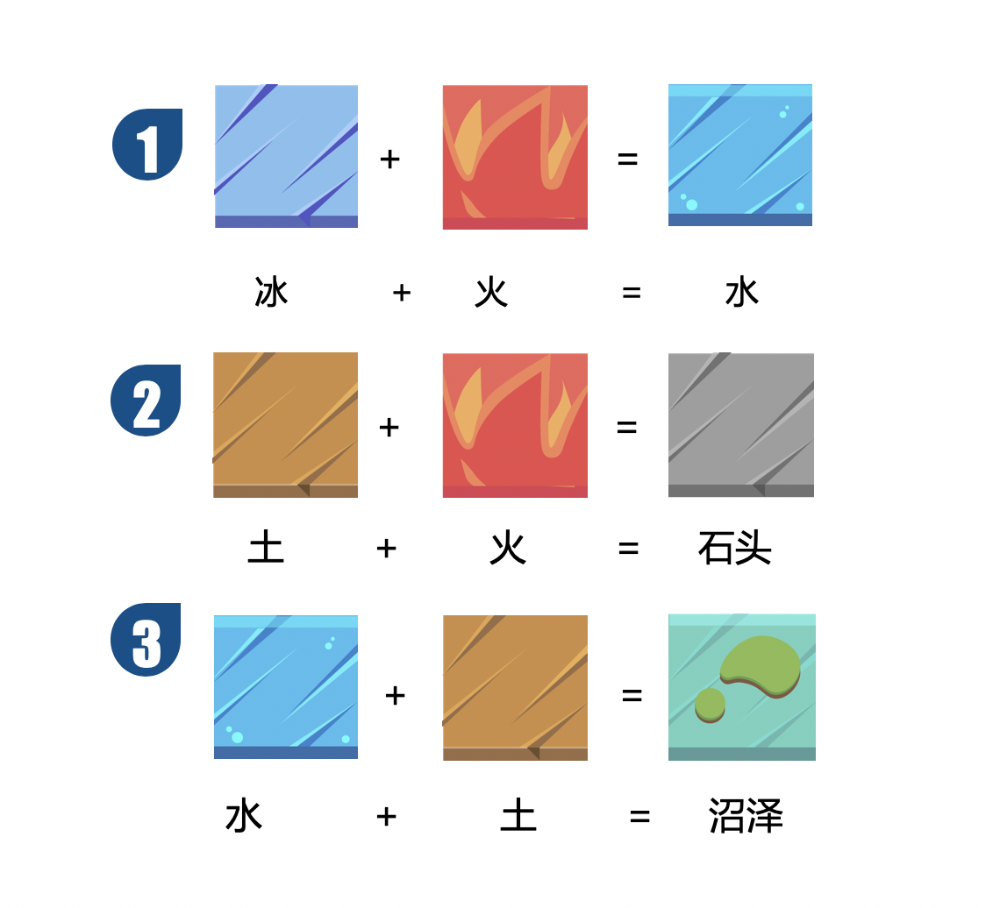
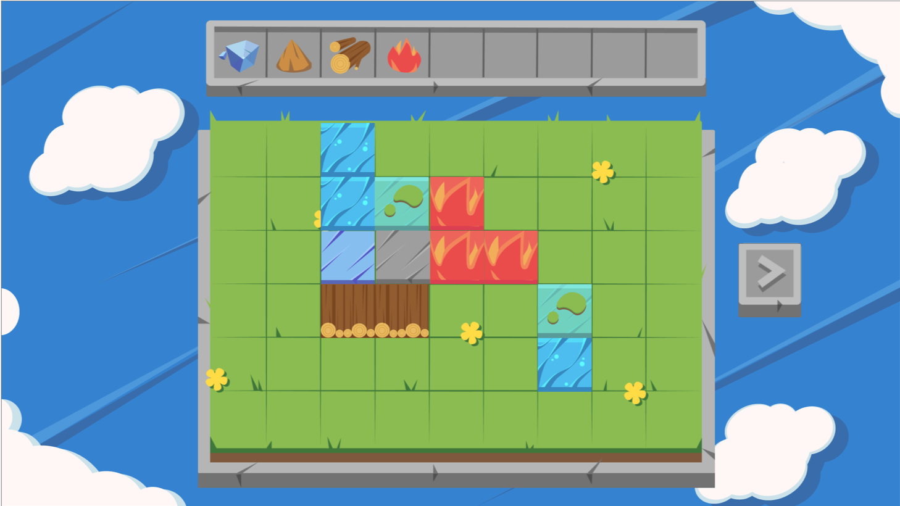
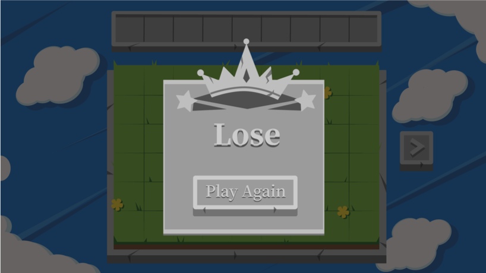

# Alive

## 2019 Unique Hackday 主题：野火

### 游戏地址：https://zhangyuiris.github.io/Wildfire/#/(GitHub Page有点慢，要多加载一会，第一遍游戏体验不会很好)

### 队名：

我一点都不想吃火锅烧烤披萨蛋糕小龙虾卤猪蹄锅包肉冰淇淋队

### 成员配置：

设计：Twelve

产品：宋傻岚

技术：章鱼([zhangyuiris](https://github.com/zhangyuiris))，张豆([kastnerorz](https://github.com/kastnerorz))

## Part01 选题意义

### 野火

- 生命力强
- 高传播能力
- 破坏自然环境

## Part02 产品设计

**游戏目标：**

火苗会在棋局上蔓延，并且有可能吞没水和沼泽
玩家使用和叠加原始元素冰，土，木头，消灭所有火元素

- 玩家和系统轮流回合，玩家回合玩家可进行元素合成操作
- 若火元素占满所有可以蔓延的格子，玩家输掉游戏。若所有火元素被扑灭，玩家胜出
- 自然元素之间会发生不同的自然反应，生成不同的物质
- 通过野火的蔓延性和各个元素之间的反应，增加游戏趣味性

## Part03 元素设计

### 元素

### 公式

## Part04 游戏设计

